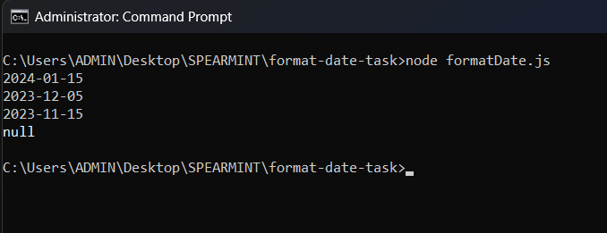
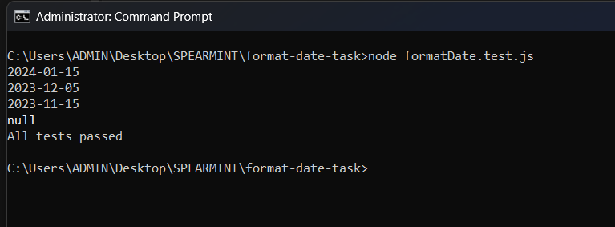

# Format Date – AI Assisted JavaScript Task

## Objective

Generate a minimal vanilla JavaScript function using an AI tool to format date inputs into `YYYY-MM-DD` format, with validation and basic testing.

---

## ACT 1 – BASE SETUP (PROJECT STATE)

This ACT documents the repository surface exactly as it exists.

| FILE | TYPE | PURPOSE |
|------|------|---------|
| formatDate.js | JavaScript | Core date formatting logic |
| formatDate.test.js | JavaScript | Minimal assertion-based tests |
| node_formatDate.js.png | Image | Terminal output proof for main execution |
| node_formatDate.test.js.png | Image | Terminal output proof for test execution |

---

## ACT 2 – AI PROMPT USED

Write a vanilla JavaScript function `formatDate(input)` that accepts a Date object, a date string, or a timestamp.  
Return a string in `YYYY-MM-DD` format.  
If the input is invalid, return `null`.  
Include a few example calls.

---

## ACT 3 – FUNCTION EXECUTION VERIFICATION

### Command Executed
node formatDate.js

### Observed Output
2024-01-15  
2023-12-05  
2023-11-15  
null  

### Screenshot Proof

This confirms:
- Date object parsing works
- Date string parsing works
- Timestamp parsing works
- Invalid input returns null

---

## ACT 4 – TEST EXECUTION VERIFICATION

### Command Executed
node formatDate.test.js

### Observed Output
All tests passed

### Screenshot Proof

This confirms:
- Function is correctly exported
- All valid and invalid cases behave as expected
- No runtime or assertion errors remain

---

## ACT 5 – INTENTIONAL BUG AND AI DEBUGGING

- Bug introduced: Used `getMonth()` instead of `getMonth() + 1`
- Resulting issue: Incorrect month values
- AI-assisted fix: Restore `+ 1` and apply zero-padding
- Final state: All tests pass after fix

---

## FINAL STATE

- Task requirements satisfied
- Validation implemented
- Tests included and passing
- Terminal output verified with screenshots
- Reviewer does not need to run code
